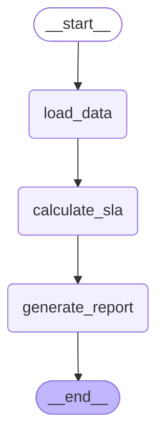

```mermaid
graph TD;
   __start__([<p>__start__</p>]):::first
   load_data(load_data)
   calculate_sla(calculate_sla)
   generate_report(generate_report)
   __end__([<p>__end__</p>]):::last
   __start__ --> load_data;
   calculate_sla --> generate_report;
   load_data --> calculate_sla;
   generate_report --> __end__;
   classDef default fill:#f2f0ff,line-height:1.2
   classDef first fill-opacity:0
   classDef last fill:#bfb6fc
```
